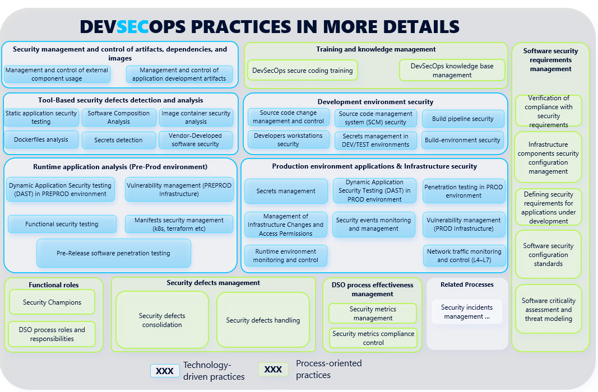
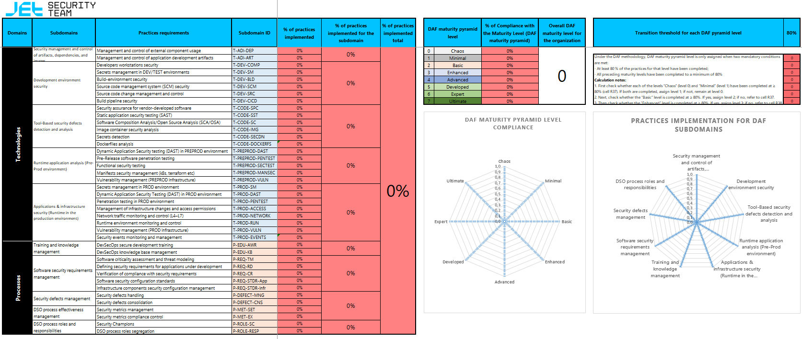
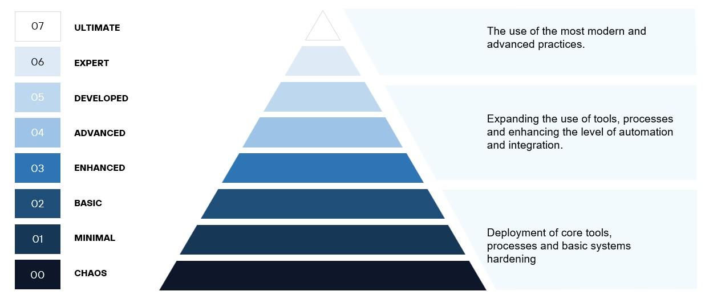

# DevSecOps Assessment Framework (DAF)

### Contents
- [Introduction](#introduction)
    - [Important Disclaimer](#important-disclaimer)
- [Goals and Objectives of DAF](#goals-and-objectives-of-daf)
- [Description of DAF](#description-of-daf)
    - [DAF map](#daf-map)
    - [DAF assesment outcomes](#daf-assesment-outcomes)
    - [DAF maturity pyramid](#daf-maturity-pyramid)
    - [DAF practices and requirements](#daf-practices-and-requirements)
- [How to use the Framework](#how-to-use-the-framework)
- [Materials used to develop DAF](#materials-used-to-develop-daf)
- [Contact Us](#contact-us)

## Introduction

There are many useful frameworks for evaluating the secure development processes, such as SAMM, BSIMM, DSOMM, and Microsoft SDL. There are also best practices, benchmarks, and recommended approaches for protecting container environments, 
such as the NSA Kubernetes Hardening Guide or CIS for Kubernetes. In addition, many tools improve the security when building and enhancing DevSecOps processes (SAST, DAST, SCA, container security, secret management, and others); each with its own configuration and usage recommendations. However, there is no single framework that clearly describes what must be done and in which order to establish a secure development process, objectively assess existing maturity level, and identify next steps.

The DevSecOps Assessment Framework (DAF) aims to solve this problem. It consolidates recommendations and best practices from various areas of DevSecOps and integrates our community's extensive expertise structured and adapted to modern realities. Some practices from well-known frameworks are not included in DAF, but new and more detailed practices have been added instead. All models, domains, subdomains, and practices are described in clear language to avoid ambiguity and misinterpretation.

### Important Disclaimer

Not all of our work on DAF is publicly available. However, we believe that the main part of the framework should remain public, specifically:

- DAF general overview (DAF map);
- DAF assesment outcomes;
- DAF maturity pyramid;
- DAF practices and requirements - description of *Technology* and *Process* models, including domains, subdomains, and 
  practices, as well as mapping of these practices to other widely known frameworks (BSIMM, SAMM, DSOM, etc.).

**All of this will remain publicly available forever.**

There is, however, a "closed" part that we implement in our audit projects using DAF. It includes:
- Questionnaires for development teams to collect information from them offline;
- Detailed examples of how to verify that a given practice is **actually** implemented, as well as examples of how **each** practice should be implemented;
- A roadmap for building DevSecOps processes based on each practice and its implementation;
- Dynamic visualization — highlighting each cell of the DAF maturity pyramid, assesment outcomes, and DAF map depending on the degree of practice implementation;
- A detailed and customizable audit report based on DAF;
- Automated calculation of DevSecOps/AppSec FTE requirements for implementing DevSecOps tools, taking into account the number of development teams and planned tasks;
- And much more.

## Goals and Objectives of DAF

When implementing secure software development practices and processes, the first and most important question companies face is **“Where to start?”**. To answer this question, you may follow these steps:

1. Determine where you are now.
2. Determine the direction of development.
3. Define the target state.
4. Identify initiatives that will help to achieve the target state.
5. Analyze collected information to assess required resources.
6. Create a roadmap for implementing the initiatives.
7. Implement the initiatives.

The main objectives in creating DAF were:

- Form a set of practices that cover the entire secure development process in detail.
- Ensure those practices remain relevant.
- Make the maturity assessment process as simple as possible.
- Provide an approach to define an organization's current maturity level and the practices associated with it.
- Provide clear visualization to improve understanding of results.
- Build an incremental approach to maturity levels.

## Description of DAF

The DevSecOps Assessment Framework is a maturity assessment framework for secure software development. Here, the word “framework” refers to a set of tools, principles, rules, guidelines, and processes that help create secure software.

**DAF consists of four main components:**

- DAF map;
- DAF assesment outcomes;
- DAF maturity pyramid;
- DAF practices and requirements.

### DAF Map

The *DAF Map* provides a high-level view of the entire framework. It includes all aspects of the secure development process, from planning to production deployment. The map is divided into two blocks: the *Technology* model and the *Process* model. 

#### DAF assesment outcomes

The assesment outcomes shows the degree of practices' implementation within a subdomain across four practice complexity levels (in percentages). For example, if compliance with the THIRD stage of “Secrets Identification” requires meeting four conditions but only two are met, the assesment outcomes will display “50%” compliance for stage three.

The main purpose of the assesment outcomes is **visualization the collected data.**

There are three main parts of assesment outcomes:
- **Stages 0-2** - from Chaos to Basic - the main purpose is to implement basic practices and processes, integrate security tools, and ensure that your developer teams use them.
- **Stages 3-5** - from Enhanced to Developed - the main purpose is to scale the tools for maximum coverage and integrate advanced tools for secure development.
- **Stages 6, 7** - Expert and Ultimate - processes and tools are fully developed (though there's always room for improvement). At these stages consider integrating most advanced and challenging practices.

### DAF maturity pyramid

The DAF maturity pyramid shows the sequence of secure development practices with maximum detail of all activities.

**Its purposes are:**

- **Understanding the current state of secure development processes**: The company is able to determine its current maturity level.
- **Planning**: The pyramid helps plan the next steps in developing secure development processes.
- **Motivation**: By tracking progress on the pyramid, development teams can see their progression, which motivates further improvements.
- **Standardization**: The pyramid can form the basis for internal standards and policies for improving secure development processes.

**Choosing the target maturity level** follows this algorithm:

1. By default, the target stage is “Basic,” which includes integration of basic tools and processes with the necessary initial scope.
2. If secure development practices at **each** of stages 0–2 are implemented at 80–100%, the target stage should be “Enhanced” or “Advanced.”
3. If secure development practices at stages 0–2 are implemented at 80–100%, but practices at any stage 3–5 are implemented below 80%, the target stage should be “Developed.”
4. If secure development practices at **all** stages 0–5 are implemented at least 80%, the target stage may be “Expert” or “Ultimate.”

> Practices at lower levels of the pyramid have higher implementation priority than those at higher levels.

### DAF practices and requirements

This part of DAF contains various practices and evaluation criteria - “True” and “False” for stage 0, and “Implemented”, “Partially Implemented”, and “Not Implemented” for stage 1 and above. Practices are grouped into subdomains, and subdomains into domains. To achieve compliance with a given maturity stage, one or more practices may need to be implemented.

Mapping for standards is done for practices where applicable.

## How to use the Framework

Quick guide:

1. The best starting point is the “Practices and Requirements” tab, which contains all domains, subdomains, and practices. Fill in practices sequentially from top to bottom. If a subdomain is not applicable to your company, simply skip it (mark “False” at level 0 and “Not Implemented” for all practices of that subdomain).
2. To parallelize the process, assign entire subdomains to relevant business units for completion.
3. After filling in all practices on the “Practices and Requirements” spreadsheet, you can evaluate subdomain coverage percentage there. On the “DAF maturity pyramid” tab, you can also view this coverage percentage with dynamic visualization (automated coloring of subdomain cells based on your answers).
4. In the public version, the “DAF maturity pyramid” and “DAF Map” sheets do not have dynamic visualization. However:  
    - The DAF Map provides a high-level view of how domains, subdomains, and practices fit together. This visualization is suitable for audit reports.
    - The DAF maturity pyramid helps assess the maturity of your secure development processes are. For clearer visualization, manually color cells with practice groups (e.g., T-CODE-IMG-1, T-PREPROD-DAST-2, etc.) according to their completion percentage in the Assesment outcomes, and/or calculate the average percentage of completion for each group across all maturity levels. Then determine the current maturity level and set the target level using the methodology described above.
5. A colored DAF maturity pyramid can also be useful for audit reporting.

If you have ideas or suggestions to improve the framework or make it easier to use, please share them with us!

## Materials used to develop DAF

The following materials were analyzed and used in creating the framework:

- International best practices:
    - [Building Security In Maturity Model (BSIMM)](https://www.synopsys.com/software-integrity/software-security-services/bsimm-maturity-model.html);
    - [OWASP Software Assurance Maturity Model (SAMM)](https://owasp.org/www-project-samm/);
    - [DevSecOps Maturity Model (DSOMM)](https://dsomm.owasp.org/);
    - [Microsoft Security Development Lifecycle (SDL)](https://www.microsoft.com/en-us/securityengineering/sdl);
    - [GOST R 58412-2019: Secure Software Development](https://docs.cntd.ru/document/1200164529);
    - [A Model For Measuring Improvement Of Security In Continuous Integration pipelines](http://essay.utwente.nl/88916/1/Akujobi_EEMCS_faculty%20%28002%29.pdf);
    - [Open Source Software (OSS) Secure Supply Chain (SSC) Framework Simplified Requirements](https://github.com/microsoft/oss-ssc-framework/blob/main/specification/framework.md).
- Practices from the Center for Internet Security (CIS):
    - [CIS Software Supply Chain Security Guide](https://www.cisecurity.org/insights/white-papers/cis-software-supply-chain-security-guide);
    - [CIS GitHub Benchmark](https://www.cisecurity.org/insights/blog/cis-benchmarks-february-2023-update).
- Best practices:
    - Aqua Cloud Native Security Maturity Model;
    - [Secrets Management Maturity Model](https://blog.gitguardian.com/a-maturity-model-for-secrets-management/).
- Our experience and that of our clients.

## Contact Us

If you use DAF for commercial purposes, when developing local or governmental regulations, for marketing or other public purposes, or when presenting it in articles or at conferences, please let us know (for example, via chat or email).

- [Telegram: DevSecOps_Assessment_Framework](https://t.me/DevSecOps_Assessment_Framework)
- [Mail: daf@jet.su](mailto:daf@jet.su)

This information helps us understand the reach and usefulness of the framework.
