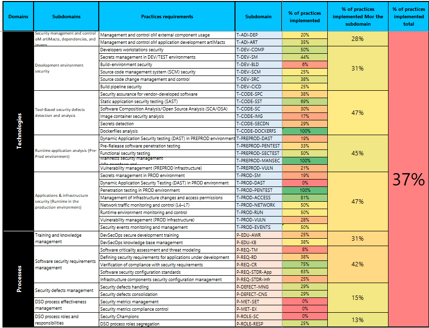

# DevSecOps Assessment Framework (DAF)

### Contents
- [Introduction](#introduction)
    - [Important Disclaimer](#important-disclaimer)
- [Goals and Objectives of DAF](#goals-and-objectives-of-daf)
- [Description of DAF](#description-of-daf)
    - [DAF Map (ex - *Pirate Map*)](#daf-map)
        - [Technology Model](#technology-model)
        - [Process Model](#process-model)
    - [Mapping to Standards and Heatmap](#mapping-to-standards-and-heatmap)
        - [Mapping to Standards](#mapping-to-standards)
        - [Heatmap](#heatmap)
    - [DAF maturity pyramid (ex - *Kirillamid*)](#maturity-pyramid)
- [How to Use the Framework](#how-to-use-the-framework)
- [Materials Used in Development](#materials-used-in-development)
- [Contact Us](#contact-us)

## Introduction

There are many useful frameworks for evaluating secure development processes, such as SAMM, BSIMM, DSOMM, and MSDL. There are also best practices, benchmarks, and recommended approaches for protecting containers and container orchestration environments, such as the NSA Kubernetes Hardening Guide or CIS for Kubernetes. In addition, many tools improve security when building and enhancing DevSecOps processes (SAST, DAST, SCA, container security, secret management, and others), each with their own configuration and usage recommendations. However, there is no single framework that clearly describes what exactly needs to be done and in what order to establish a secure development process, objectively assess the existing maturity level, and understand the next steps.

The DevSecOps Assessment Framework (DAF) aims to solve this problem. It not only consolidates recommendations and best practices from various areas of DevSecOps, but also integrates the extensive expertise of our community, structured and adapted to modern realities. Some practices from well-known frameworks are not included in DAF, but new and more detailed practices have been added instead. All models, domains, subdomains, and practices are described in clear language to avoid ambiguity and misinterpretation.

### Important Disclaimer

Not all of our work on DAF is publicly available. However, we believe that the main part of the framework should remain public, specifically:

- DAF Map (ex - *Pirate Map*);
    - *Technology* and *Process* models, including domains, subdomains, and practices, as well as mapping of these practices to other widely known frameworks (BSIMM, SAMM, DSOM, etc.);
- Mapping to standards and maturity heatmap;
- DAF maturity pyramid (ex - *Kirillamid*).

**All of this will remain publicly available forever.**

There is, however, a "closed" part that we implement in our audit projects using DAF. It includes:

- Questionnaires for development teams to collect information from them offline;
- Detailed examples of how to verify that a given practice is **actually** implemented, as well as examples of how **each** practice should be implemented;
- A roadmap for building DevSecOps processes based on each practice and its implementation;
- Dynamic visualization — highlighting each cell of the DAF maturity pyramid, heatmap, and DAF Map depending on the degree of practice implementation;
- A detailed and customizable audit report based on DAF;
- Automated calculation of DevSecOps/AppSec FTE requirements for implementing DevSecOps tools, taking into account the number of development teams and planned tasks;
- And much more.

## Goals and Objectives of DAF

When implementing secure software development practices and processes, the first and most important question companies face is **“Where to start?”** To answer this question, the following path is needed:

1. Determine where you are now;
2. Determine the direction of development;
3. Define the target state;
4. Identify initiatives that will help achieve the target state;
5. Analyze the collected information to assess the required resources;
6. Create a roadmap for implementing initiatives;
7. Implement the initiatives.

The main objectives in creating DAF were:

- To form a set of practices covering the entire secure development process in detail;
- To ensure these practices remain relevant;
- To make the maturity assessment process as simple as possible;
- To create an approach for defining the current maturity level of the organization and the practices related to that level;
- To provide clear visualization for better understanding of results;
- To build an incremental approach to maturity levels.

## Description of DAF

The DevSecOps Assessment Framework is a maturity assessment framework for secure software development. Here, the word “framework” refers to a set of tools, principles, rules, guidelines, and processes that help create secure software.

**DAF consists of three components:**

- DAF Map (ex - *Pirate Map*);
- DAF Heatmap;
- DAF maturity pyramid (ex - *Kirillamid*);
- Mapping to standards.

### DAF Map

> (ex - *Pirate Map*)

The *DAF Map* provides a high-level view of the entire framework. It includes all aspects of the secure development process, from planning to production deployment. The map is divided into two blocks: the *Technology* model and the *Process* model.

#### Technology Model

#### Process Model

#### DAF Heatmap

The heatmap shows the degree of practice implementation within a subdomain across four maturity stages (in percentages). For example, if compliance with the THIRD stage of “Secrets Identification” requires meeting four conditions, but at the time of the audit only two are met, then the heatmap will display “50%” compliance with stage three.

The main purpose of the heatmap is **visualization of collected data.**

In the evaluation table and heatmap, the following maturity stages are used (similar to most other well-known frameworks):

- **Stage 0: Chaos**  
  > At this stage, the company has no formalized processes or tools for secure development. Practices may be applied sporadically at the initiative of individual employees.

- **Stage 1: Beginners**  
  > At this stage, secure development tools begin to appear, but with minimal coverage and without automation. Basic processes emerge.
  
- **Stage 2: Basic**  
  > At this stage, the company has basic tools and processes to perform secure development process.

- **Stage 3: Enhanced**  
  > Processes at this stage become repeatable and manageable, coverage of tools expands, and automation is introduced. The company starts applying methodologies for planning, executing, and tracking activities, though they may not always be consistent or fully documented. Tools still do not cover the entire secure development process.

- **Stage 4: Advanced**  
  > At this stage, secure development tools provide maximum coverage and automation. All processes are consistent and fully documented.

- **Stage 5: Experts**  
  > At this highest stage, processes and tools are fully developed, but there is always room for improvement.

- **Stage 6: Ultimate**  
  > At this highest stage, processes and tools are fully developed, but there is always room for improvement.

### DAF maturity pyramid

> (ex - *Kirillamid*)

The term originated from merging the word *Pyramid* with the name of its original authors — ***Kirill Bochkarev***. Although it is no longer strictly a pyramid for navigational convenience, the name remains associated with this part of DAF.

The DAF maturity pyramid shows the sequence of secure development practices with maximum detail of all activities.

**Its purposes are:**

- **Understanding the current state of secure development processes**: The company can determine its current maturity level.
- **Planning**: The pyramid helps plan next steps in developing secure development processes.
- **Motivation**: By tracking progress on the pyramid, development teams can see their growth, motivating further improvements.
- **Standardization**: The pyramid can serve as the basis for internal standards and policies for improving secure development processes.

**Choosing the target maturity level** follows this algorithm:

1. By default, the target level is “Basic,” which includes introducing basic tools and processes with the necessary initial scope.
2. If secure development practices at **each** of levels 0–2 are 80–100% implemented, the target level should be “Enhanced” or “Advanced.”
3. If secure development practices at levels 0–2 are 80–100% implemented, but practices at levels 3–5 are less than 80% implemented at **any** level, the target should be “Developed.”
4. If secure development practices at **all** levels 0–5 are at least 80% implemented, the target level may be “Expert” or “Cosmic.”

> Practices at lower levels of the pyramid have a higher implementation priority compared to those at higher levels.

#### Mapping to Standards

The mapping to standards contains various practices and evaluation criteria (“True” and “False” for stage 0, as well as “Implemented,” “Partially Implemented,” and “Not Implemented” for stage 1 and higher). Practices are grouped into subdomains, and subdomains into domains. To achieve compliance with a given maturity stage, one or more practices may need to be implemented.

## How to Use the Framework

Quick guide:

1. The best starting point is the “Practices and Requirements” tab, which contains all domains, subdomains, and practices. Fill in practices sequentially from top to bottom. If a subdomain is not applicable at all in your company, simply skip it (mark “False” at level 0 and “Not Implemented” for all practices of that subdomain).
2. To parallelize the process, entire subdomains can be assigned to relevant business units in your company for completion.
3. After filling in all practices on the “Practices and Requirements” spreadsheet, you can evaluate subdomain coverage percentage there. On the “DAF maturity pyramid” tab, you can also see this coverage percentage with dynamic illumination (automated coloring of subdomain cells based on your answers).
4. In the public version, the “DAF maturity pyramid” and “DAF Map” sheets do not have dynamic illumination. However:  
    - The DAF Map provides a high-level view of how domains, subdomains, and practices fit together. This visualization is suitable for audit reports.  
    - The DAF maturity pyramid helps assess how mature your secure development processes are. For clearer visualization, you can manually color cells with practice groups (e.g., T-CODE-IMG-1, T-PREPROD-DAST-2, etc.) according to their completion percentage in the Heatmap, and/or calculate the average percentage of completion for each group across all maturity levels. Then determine the current maturity level and set the target level according to the methodology described above.
5. A colored DAF maturity pyramid can also be useful for audit reporting.

If you have ideas or suggestions on how to improve the framework or make it easier to use, please share them with us!

## Materials Used to develop DAF framework

The following materials were analyzed and used in creating the framework:

- International best practices:
    - [Building Security In Maturity Model (BSIMM)](https://www.synopsys.com/software-integrity/software-security-services/bsimm-maturity-model.html);
    - [OWASP Software Assurance Maturity Model (SAMM)](https://owasp.org/www-project-samm/);
    - [DevSecOps Maturity Model (DSOMM)](https://dsomm.owasp.org/);
    - [Microsoft Security Development Lifecycle (SDL)](https://www.microsoft.com/en-us/securityengineering/sdl);
    - [GOST R 58412-2019: Secure Software Development](https://docs.cntd.ru/document/1200164529);
    - [A Model For Measuring Improvement Of Security In Continuous Integration pipelines](http://essay.utwente.nl/88916/1/Akujobi_EEMCS_faculty%20%28002%29.pdf);
    - [Open Source Software (OSS) Secure Supply Chain (SSC) Framework Simplified Requirements](https://github.com/microsoft/oss-ssc-framework/blob/main/specification/framework.md).
- Practices from the Center for Internet Security (CIS):
    - [CIS Software Supply Chain Security Guide](https://www.cisecurity.org/insights/white-papers/cis-software-supply-chain-security-guide);
    - [CIS GitHub Benchmark](https://www.cisecurity.org/insights/blog/cis-benchmarks-february-2023-update).
- Best practices:
    - Aqua Cloud Native Security Maturity Model;
    - [Secrets Management Maturity Model](https://blog.gitguardian.com/a-maturity-model-for-secrets-management/).
- Our experience, as well as that of our clients.

## Contact Us

If you use our framework for commercial purposes, in developing local or governmental regulations, for marketing or other public purposes, or if you present it in articles or at conferences — please let us know (for example, via chat or email). 

- [Telegram: DevSecOps_Assessment_Framework](https://t.me/DevSecOps_Assessment_Framework)
- [Mail: daf@jet.su](mailto:daf@jet.su)

This information helps us understand the reach and usefulness of our framework.
